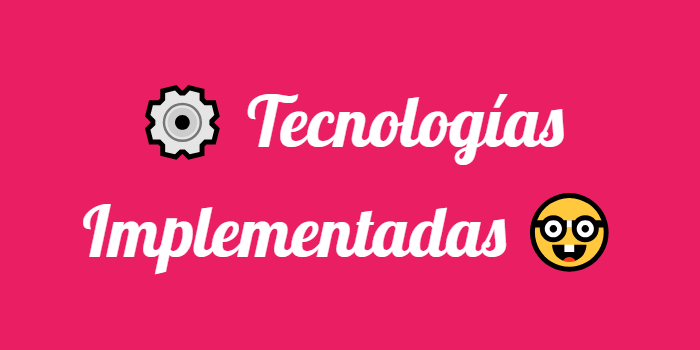

<section align="center">

<h2><b>Personal Docente: </b></h2>
<ul style="list-style-type: none;">
  <li><b>Prof. Adjunta</b> - Ing. Cecilia Massano</li>
  <li><b>JTP</b> - Ing. Valeria Abdala</li>
  <li><b>Ayudante de Cátedra</b> - Maria Salomé Sanchez Cassia</li>
  <li><b>Colaboradora</b> - Paz Costamagna</li>
</ul>

<h2><b>Integrantes del Grupo: </b></h2>
<ul style="list-style-type: none;">
  <li>Spadachini Benedetti, Martin Matias ; Legajo: 95168</li>
  <li>Buchaillot, Julieta ; Legajo: 95782</li>
  <li>Martinet, Agustina Maria Andrea ; Legajo: 94674</li>
  <li>Ledesma, Javier ; Legajo: 98922</li>
  <li>Romero Moreno, Oscar Alfonso ; Legajo: 96454</li>
  <li>Lucini, Gabriel Alejandro ; Legajo: 98023</li>
  <li>Sadir, Emilio ; Legajo: 96622</li>
  <li>Florencia, Daniela Garcia ; Legajo: 94477</li>
  <li>Baigorria, José Alejo ; Legajo: 96269</li>
  <li>Frontera, Matías ; Legajo: 98502</li>
</ul>

</section>

<section align="justify">

  
  
  

  
Información del Proyecto.
  

</section>

<section align="center">

  

  
</section>

<section align="center">

  

Información.

  

  

</section>
